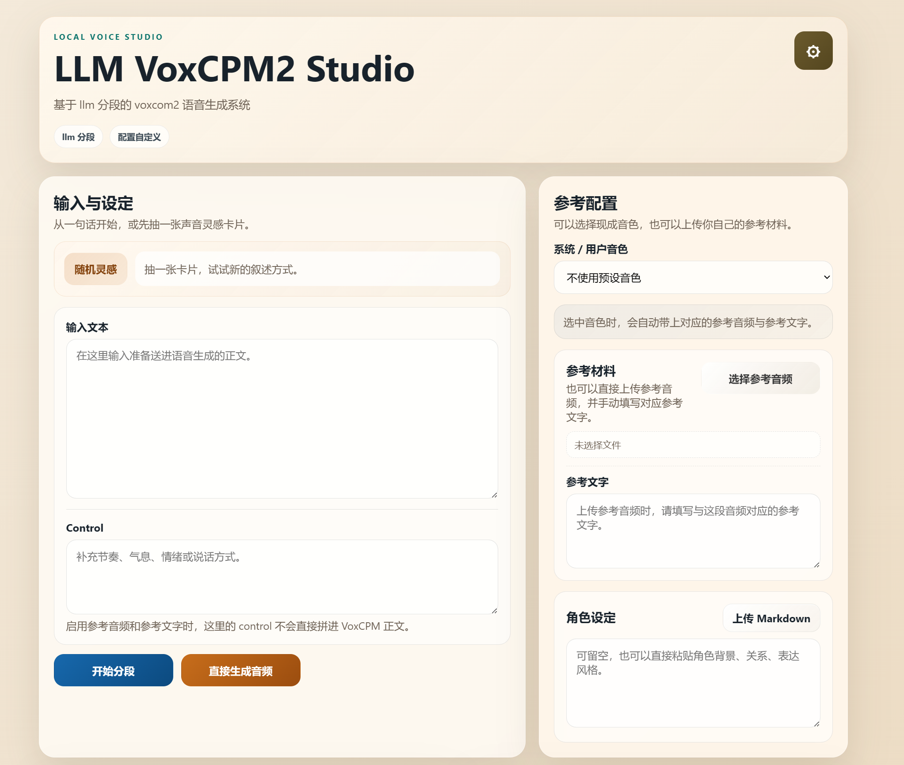
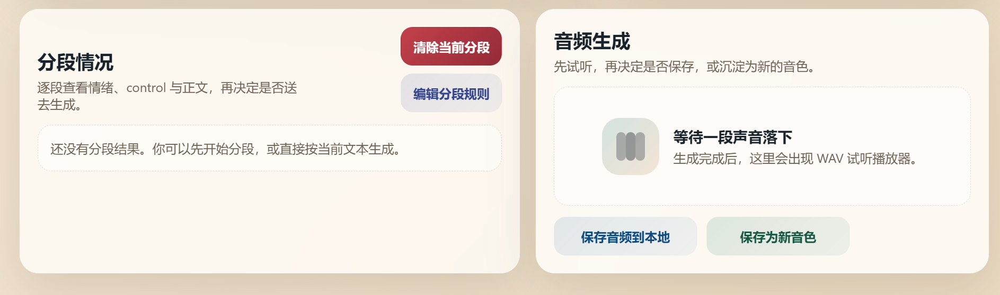

# LLM VoxCPM2 Studio
一个本地启动的网页工具，用于把文本经过 LLM 分段后，交给 VoxCPM2 生成语音。

它适合这样的使用方式：

- 输入一段正文
- 让 LLM 生成更适合 TTS 的分段结果
- 结合参考音频、参考文字或现成音色进行语音生成
- 在网页中试听、调整并保存结果

项目入口：

- `server.py`

参考资料：

- VoxCPM GitHub: https://github.com/OpenBMB/VoxCPM
- VoxCPM Documentation: https://voxcpm.readthedocs.io/en/latest/

## 功能概览

- 本地网页界面
- LLM 分段与可编辑分段结果
- VoxCPM2 本地生成
- 参考音频 + 参考文字模式
- 系统音色 / 用户音色管理
- 音频网页试听与手动保存

## 安装

依赖分为两部分：

- 本应用自己的 Web / API 依赖
- 本地运行 VoxCPM2 所需依赖

建议先进入你的 Python 环境，再按下面顺序安装。

### 1. 安装应用依赖

```bash
pip install -r requirements-app.txt
```

这部分用于启动网页界面和后端接口。

### 2. 安装 VoxCPM2 本地依赖

```bash
pip install -r requirements-voxcpm-local.txt
```

这部分用于本地语音生成。当前依赖文件按 CUDA 版 PyTorch 组织，适合有 NVIDIA GPU 的环境。

如果你暂时只想查看界面，而不运行本地 TTS，可以先只安装：

```bash
pip install -r requirements-app.txt
```

## 模型准备

你可以通过以下两种方式准备 VoxCPM2 模型。

### 方式一：使用本地模型目录

在设置中将 `VoxCPM Model Path / Repo` 填为本地路径，例如：

```text
E:\models\voxcpm2
```

### 方式二：使用 Hugging Face 仓库名

在设置中将 `VoxCPM Model Path / Repo` 填为仓库名，例如：

```text
openbmb/VoxCPM2
```

然后点击页面中的“下载 HF 模型到当前文件夹”。

下载完成后，将该输入框改为下载后的本地模型目录即可。

## 启动

```bash
python server.py
```

默认访问地址：

```text
http://127.0.0.1:7860
```

## 首次配置

启动后，点击页面右上角设置，检查以下内容：

- `LLM Provider`
- `Base URL`
- `API Key`
- `Model`
- `TTS Adapter`
- `VoxCPM Model Path / Repo`

默认 `LLM Provider` 按 OpenAI 接口格式配置。

## 使用说明

### 1. 输入正文

在“输入与设定”中填写需要朗读的文本。

你也可以在 `Control` 中补充：

- 语气
- 节奏
- 停顿
- 说话方式

如果你只是想快速尝试，也可以使用页面里的随机灵感内容。

### 2. 选择参考方式

你可以选择以下任意一种方式：

- 上传参考音频，并填写对应参考文字
- 选择现成音色
- 不使用参考，直接生成

如果选择现成音色，系统会自动读取该音色目录中的：

- `reference.txt`
- `reference.wav` 或其他支持的 `reference.*`

当前支持的参考音频格式包括：

- `wav`
- `mp3`
- `flac`
- `m4a`
- `ogg`

### 3. 开始分段

点击“开始分段”后，LLM 会返回适合当前流程的分段结果。

你可以在“分段情况”中逐段查看和修改：

- `emotion`
- `control`
- `text`

如果你不想使用 LLM 分段，也可以直接点击“生成音频”。

### 4. 生成音频

点击“生成音频”后，后端会将当前内容发送给 VoxCPM2。

当前网页试听输出为：

- `wav`

默认不会自动保存到项目目录。生成后你可以：

- 直接试听
- 手动保存音频到本地
- 将满意结果保存为新的用户音色

### 5. 保存用户音色

保存后的用户音色会写入：

```text
voice/usr/<voice_id>/
```

目录内容为：

- `voice.json`
- `reference.txt`
- `reference.wav`

后续即可在页面中直接选择该音色。

## 音色目录约定

系统音色和用户音色采用相同目录结构：

```text
voice/<scope>/<voice_id>/
  voice.json
  reference.txt
  reference.wav
```

其中：

- `voice.json` 保存最小元数据
- `reference.txt` 保存参考文字
- `reference.wav` 保存参考音频

也支持以下参考音频文件名：

- `reference.mp3`
- `reference.flac`
- `reference.m4a`
- `reference.ogg`

## 提示词与角色设定

可编辑文件：

- `prompts/tts_segmentation_prompt.md`
- `prompts/soul.md`

说明：

- `tts_segmentation_prompt.md` 用于控制分段规则
- `soul.md` 用于角色设定参考，可选使用

## 注意事项

### 1. 首次生成会比较慢

首次真正调用 VoxCPM2 时，模型会加载并 warm up，因此会比后续请求慢一些。

### 2. 参考模式下 control 不一定会直接生效

如果同时启用了参考音频和参考文字，系统不会再把 `control` 直接拼接到 VoxCPM 正文中。此时模型会优先参考已有声音。

### 3. 何时更适合不用参考

如果你更想测试文本控制、情绪变化或随机声音，建议先不带参考，直接生成。
